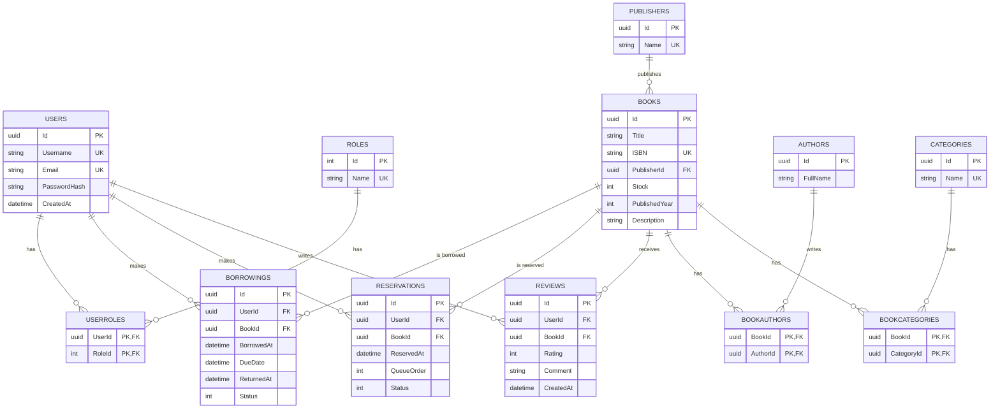

# ER Diyagramı

## Composite Key Kullanılan Tablolar
- **UserRoles**: (UserId, RoleId)
- **BookAuthors**: (BookId, AuthorId)
- **BookCategories**: (BookId, CategoryId)

## Unique Alanlar
- Users.Username, Users.Email
- Roles.Name
- Categories.Name, Publishers.Name
- Books.ISBN
- Reviews: (UserId, BookId) composite unique — bir kullanıcı bir kitaba tek yorum
- Reservations: (UserId, BookId) composite unique **where Status = Active** (partial unique index)

## Index Gerektiren Alanlar
- Books.Title (arama için)
- Books.ISBN
- Borrowings.UserId, Borrowings.BookId, Borrowings.Status
- Reservations.BookId, Reservations.Status
- Reviews.BookId
- Tüm FK alanları